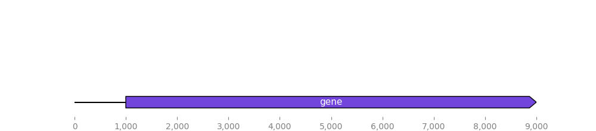

# Summary of Changes and Git Operations

This document outlines the fixes applied to the `BiopythonTranslatorBase.py` module and the Git commands used to resolve remote repository issues.

## `BiopythonTranslatorBase.translate_record` Function Fix

The `translate_record` function in `dna_features_viewer/BiopythonTranslator/BiopythonTranslatorBase.py` was modified to handle GFF files that do not contain sequence data.

### The Problem

The original implementation assumed that the Biopython record object would always have a sequence. When it encountered a GFF file without a sequence, it would raise a `Bio.Seq.UndefinedSequenceError`, causing the program to crash. This was identified when the `test_gff` unit test failed.

### The Solution

The function was updated to gracefully handle this error by wrapping the sequence-accessing code in a `try...except` block.

1.  **Import `UndefinedSequenceError`**: The specific exception was imported from `Bio.Seq` to be caught.
2.  **Implement `try...except`**:
    *   The code now first *tries* to get the sequence length and content from the record (`len(record)`, `str(record.seq)`).
    *   If an `UndefinedSequenceError` occurs, the `except` block is executed. It calculates the sequence length by finding the maximum `end` position among all features in the record. The sequence itself is set to `None`.

This ensures the `GraphicRecord` is always created with a valid sequence length, preventing crashes when processing sequence-less GFF files.

## Git Remote and Branch Cleanup Operations

A series of Git commands were executed to synchronize the local repository with a new remote, resolve conflicts, and standardize the primary branch name.

1.  **Switching Remote Origin**: The existing `origin` remote was removed and a new one was added by the user.
2.  **Handling Divergent Histories**: The initial attempt to `git push` failed because the local and remote `master` branches had diverged.
3.  **Resolving Merge Conflicts**:
    *   A `git pull` was performed to fetch the remote changes.
    *   This resulted in a merge conflict in `BiopythonTranslatorBase.py`. The conflict occurred because the local version contained the `try...except` fix while the remote version did not.
    *   The conflict was resolved by manually editing the file to keep the local changes, which were more robust.
    *   The resolved file was staged (`git add`) and the merge was committed (`git commit`).
4.  **Pushing Changes**: After the merge, `git push` successfully updated the remote `master` branch.
5.  **Renaming `master` to `main`**:
    *   The local `master` branch was renamed to `main` (`git branch -m master main`).
    *   The new `main` branch was pushed to the remote, and the upstream tracking reference was set (`git push -u origin main`).
    *   The `master` branch was deleted from the remote (`git push origin --delete master`). This initially failed because `master` was still the default branch on GitHub.
    *   After the user changed the default branch to `main` in the GitHub repository settings, the command was re-run successfully.

## Understanding the BiopythonTranslatorBase with a non sequence bearing record

To illustrate the fix, here's the GFF file used in the test (`tests/data/no_sequence.gff`):

```gff
##gff-version 3
#gff-spec-version 1.21
##sequence-region ctg123 1 1497228
ctg123	.	gene	1000	9000	.	+	.	ID=gene00001;Name=EDEN
ctg123	.	TF_binding_site	1000	1012	.	+	.	ID=tfbs00001;Parent=gene00001
ctg123	.	exon	1050	1500	.	+	.	ID=exon00001;Parent=gene00001
ctg123	.	exon	3000	3902	.	+	.	ID=exon00002;Parent=gene00001
ctg123	.	exon	5000	5300	.	+	.	ID=exon00003;Parent=gene00001
ctg123	.	exon	7000	7600	.	+	.	ID=exon00004;Parent=gene00001
ctg123	.	CDS	1201	1500	.	+	0	ID=cds00001;Parent=gene00001;Name=EDEN.1
ctg123	.	CDS	3000	3902	.	+	0	ID=cds00001;Parent=gene00001;Name=EDEN.1
ctg123	.	CDS	5000	5300	.	+	0	ID=cds00001;Parent=gene00001;Name=EDEN.1
ctg123	.	CDS	7000	7600	.	+	0	ID=cds00001;Parent=gene00001;Name=EDEN.1
```

And here's the graphical output generated by `DnaFeaturesViewer` from this GFF file (`examples/gff_with_no_sequence.png`):

